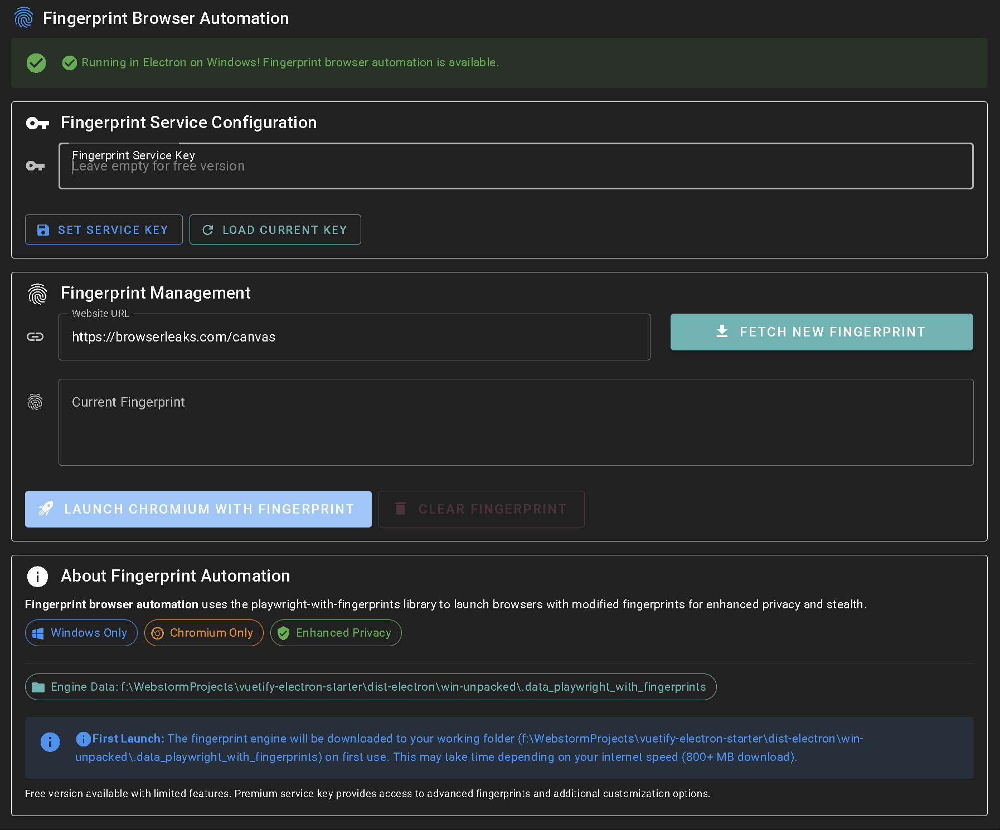
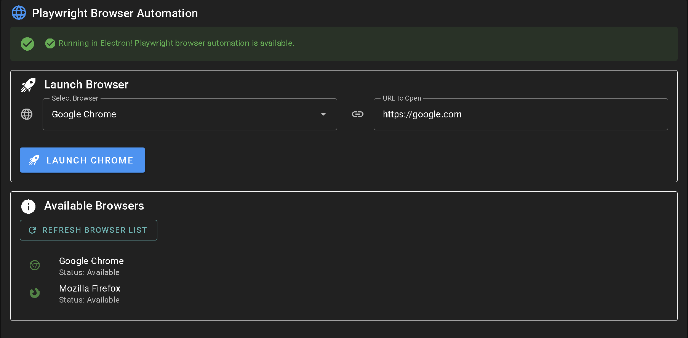
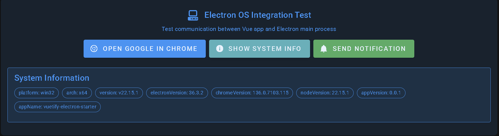

# Vuetify Electron Starter

A modern starter template for building Windows desktop applications with `Vue.js 3`, `Vuetify 3`, and `Electron`.

This template combines the power of modern web technologies with native Windows desktop capabilities.

**Main goal: Create a Windows app that can automate browsers**:
This is a `proof-of-concept` demonstrating browser automation technologies including
standard [Playwright](https://playwright.dev/) and advanced fingerprint automation
with [`playwright-with-fingerprints`](https://github.com/CheshireCaat/playwright-with-fingerprints).

## 🚀 Quick Download & Start

### Download Pre-built Application

**Latest Release: [v0.0.2](https://github.com/sergerdn/vuetify-electron-starter/releases/tag/v0.0.2)**

1.**Download**:

- Go to [Releases](https://github.com/sergerdn/vuetify-electron-starter/releases)
- Click on the latest release
- Under "Assets," download the `.zip` file (e.g., `VuetifyElectronStarter-0.0.2-x64.zip`)

2.**Extract**: Right-click the downloaded `.zip` file and select "Extract All..." to your desired location
3.**Run**: Navigate to the extracted folder and double-click `VuetifyElectronStarter.exe` to start the application

### What You Get

- ✅ **Ready-to-use Windows desktop app**: No installation required
- ✅ **Browser automation tools**: Chrome and Firefox automation
- ✅ **Advanced fingerprint automation** - Stealth browsing capabilities
- ✅ **Modern UI** - Vue.js 3 + Vuetify 3 interface

### First Launch Notes

⚠️ **Important**: On the first use of fingerprint automation:

- The app will download the fingerprint engine (800+ MB) when you first click "Launch Browser" in the fingerprint
  section
- Download time depends on your internet speed
- This is a one-time download, later fingerprint requests are instant

### System Requirements

- **OS**: Windows 10/11 (x64)
- **RAM**: 4GB minimum, 8GB recommended
- **Storage**: 2GB free space (for fingerprint engine)
- **Internet**: Required for initial setup and fingerprint downloads

## 📸 Screenshots







## ✨ Features

### 🖥️ Desktop Application

- **[Electron](https://www.electronjs.org/)**: Latest stable version for Windows desktop apps
- **[electron-vite](https://electron-vite.org/)**: Modern build tooling for Electron
- **[electron-builder](https://www.electron.build/)**: Complete solution to package and build Electron apps
- **OS Integration**: IPC communication between renderer and main process
- **[Playwright](https://playwright.dev/) Browser Automation**: Launch and control Chrome/Firefox browsers with CDP
  support
- **Fingerprint Browser Automation**: Enhanced privacy automation with [
  `playwright-with-fingerprints`](https://github.com/CheshireCaat/playwright-with-fingerprints)
- **External Browser Control**: Open URLs in Chrome or default browser
- **Native Notifications**: System-level notification support
- **System Information API**: Access to platform and version details

### 🚀 Modern Web Stack

- **[Vue.js 3](https://vuejs.org/)**: Progressive JavaScript framework with Composition API
- **[Vuetify 3](https://vuetifyjs.com/)**: Material Design component framework
- **[Vite](https://vitejs.dev/)**: Next generation frontend tooling
- **[TypeScript](https://www.typescriptlang.org/)**: Full TypeScript support throughout the project
- **[Pinia](https://pinia.vuejs.org/)**: Intuitive state management for Vue

### 🧪 Testing & Quality

- **Vitest**: Fast unit testing framework
- **Cypress**: End-to-end testing framework
- **ESLint**: Code linting and formatting
- **Auto-imports**: Automatic imports for Vue and utilities

### 🔧 Development Experience

- **Hot Module Replacement**: Instant updates during development
- **DevTools Integration**: Built-in debugging capabilities
- **Modern Security** Context isolation and secure preload scripts
- **Auto-updater Ready**: Built-in support for application updates (planned)
- **Icon Integration**: Automatic Windows icon support with a build process

## Prerequisites

- [Node.js](https://nodejs.org/) (v22 or higher)
- npm

## Installation

```bash
git clone https://github.com/sergerdn/vuetify-electron-starter.git
cd vuetify-electron-starter
npm install
```

## 🚀 Quick Start

### Web Development

Start the web development server:

```bash
npm run dev
```

This will start the Vite development server at `http://localhost:3000` with hot module replacement.

### Electron Development

Start the Electron application in development mode:

```bash
npm run electron:dev
```

This will:

- Build the main and preload processes
- Start the Vite development server
- Launch the Electron application with DevTools enabled
- Enable hot reload for both the renderer and main processes

### Building for Production

#### Web Build

Build the web application for production:

```bash
npm run build
```

#### Electron Build

Build the complete Electron application:

```bash
npm run electron:build
```

This will:

- Build the renderer process (Vue.js app)
- Build the main and preload processes
- Package the application using electron-builder
- Create platform-specific installers and executables

**Output:**

- `dist-electron/{version}/win-unpacked/` - Unpacked Windows application folder (e.g.,
  `dist-electron/0.0.2/win-unpacked/`)
- `dist-electron/{version}/win-unpacked/VuetifyElectronStarter.exe` - Windows executable with custom icon

**Windows Build Fix:**

Create this directory before building to avoid fsevents errors:

```bash
mkdir ./node_modules/playwright/node_modules/fsevents
```

### Preview Built Application

Preview the built Electron application:

```bash
npm run electron:preview
```

### Testing

Run unit tests:

```bash
npm run test
```

Run E2E tests:

```bash
npm run test:e2e
```

## 🎭 Fingerprint Browser Automation

**Advanced stealth automation** using 
[`playwright-with-fingerprints`](https://github.com/CheshireCaat/playwright-with-fingerprints) for enhanced privacy and
detection avoidance.

### Key Features

- **Enhanced Privacy**: Modified browser fingerprints for stealth automation
- **Service Integration**: Free and premium fingerprint service support
- **Windows Optimized**: Specifically designed for Windows environments
- **Chromium Engine**: Uses Chromium with fingerprint modifications

### How It Works

1. **Set Service Key**: Enter your fingerprint service key (optional for free tier)
2. **Fetch Fingerprint**: Get a fresh fingerprint with Windows/Chrome tags
3. **Launch Browser**: Start Chromium with the applied fingerprint
4. **Stealth Browsing**: Browse websites with modified fingerprint data

### First-Time Setup

⚠️ **Important**: On the first fingerprint request, the fingerprint engine downloads (800+ MB)

- **Download Time**: Depends on internet speed
- **Storage**: `.data_playwright_with_fingerprints` directory
- **One-Time**: Subsequent fingerprint requests are instant

### Testing Fingerprints

Visit fingerprint testing sites to verify the modifications:

- `https://browserleaks.com/canvas`
- `https://fingerprint.com/demo`
- `https://amiunique.org`

## 🌐 Standard Browser Automation

**Multi-browser automation** with Chrome and Firefox support for general automation tasks.

### Features

- **Browser Choice**: Chrome or Firefox selection
- **CDP Integration**: Chrome DevTools Protocol for external tools
- **Session Management**: Multiple browser instances
- **System Integration**: Uses your installed browsers

### CDP Access

Each browser provides automation endpoints:

- **Chrome**: `http://localhost:9222`
- **Firefox**: `http://localhost:9223`
- **External Tools**: Connect Puppeteer, Selenium, or other automation frameworks

### Visual Indicators

- **Chrome**: "Chrome is being controlled by automated test software" banner
- **Firefox**: Similar automation warning
- **Console Logs**: Detailed process information and CDP endpoints

## 🏗️ Technical Architecture

### Project Structure

```
├── public/                           # Static assets
│   └── favicon.ico                   # Application favicon
├── src/                              # Source code
│   ├── electron-main/                # Electron main process (Windows-focused)
│   │   ├── services/                 # Business logic services
│   │   │   ├── PlaywrightService.ts  # Playwright automation service
│   │   │   └── FingerprintPlaywrightService.ts # Fingerprint automation service
│   │   ├── handlers/                 # IPC communication handlers
│   │   │   ├── PlaywrightHandlers.ts # Playwright IPC handlers
│   │   │   └── FingerprintPlaywrightHandlers.ts # Fingerprint IPC handlers
│   │   └── index.ts                  # Main process entry point
│   ├── electron-preload/             # Electron preload scripts
│   │   ├── index.ts                  # Preload script
│   │   └── types.d.ts                # TypeScript definitions
│   ├── components/                   # Vue components
│   │   ├── PlaywrightIntegration.vue # Standard browser automation UI
│   │   ├── FingerprintPlaywrightIntegration.vue # Fingerprint automation UI
│   │   ├── ElectronIntegration.vue   # Desktop integration UI
│   │   └── Dashboard.vue             # Main dashboard component
│   ├── layouts/                      # Page layouts
│   ├── pages/                        # Application pages
│   ├── plugins/                      # Vue plugins
│   ├── router/                       # Vue Router configuration
│   ├── stores/                       # Pinia stores
│   ├── styles/                       # Global styles and Vuetify settings
│   ├── utils/                        # Utility functions
│   ├── config/                       # Configuration management
│   ├── auto-imports.d.ts             # Auto-generated import types
│   ├── components.d.ts               # Auto-generated component types
│   ├── typed-router.d.ts             # Auto-generated router types
│   ├── App.vue                       # Root Vue component
│   └── main.ts                       # Application entry point
├── tests/                            # Comprehensive test suite
│   ├── setup.ts                      # Global test setup and utilities
│   ├── unit/                         # Unit and component tests (Vitest)
│   │   ├── components/               # Vue component tests
│   │   └── config/                   # Configuration unit tests
│   ├── integration/                  # Integration tests (Vitest)
│   │   └── config_integration.spec.ts # Configuration integration tests
│   ├── e2e/                          # End-to-end tests (Cypress)
│   │   ├── fixtures/                 # Test data for E2E tests
│   │   ├── support/                  # Cypress support files
│   │   ├── screenshots/              # Test screenshots (auto-generated)
│   │   ├── videos/                   # Test videos (auto-generated)
│   │   └── home.cy.js                # Sample E2E test
│   ├── fixtures/                     # Shared test fixtures
│   │   └── env_files.ts              # Environment file fixtures
│   └── helpers/                      # Test helper utilities
│       └── config_helpers.ts         # Configuration test helpers
├── docs/                             # Documentation
│   └── screenshots/                  # Application screenshots
├── build-electron/                   # Compiled Electron files (auto-generated)
│   ├── electron-main/                # Compiled main process
│   ├── electron-preload/             # Compiled preload scripts
│   └── renderer/                     # Compiled renderer (Vue app)
├── dist-electron/                    # Built Windows application (auto-generated)
│   └── {version}/                    # Version-specific build output (e.g., 0.0.2/)
│       ├── win-unpacked/             # Unpacked Windows application
│       ├── builder-debug.yml         # Electron builder debug info
│       └── builder-effective-config.yaml # Effective build configuration
├── build-resources/                  # Build assets (icons, etc.)
│   ├── README.md                     # Icon and build resources guide
│   ├── v-logo.ico                    # Windows application icon
│   └── v-logo.svg                    # SVG source icon
├── scripts/                          # Build and utility scripts
├── node_modules/                     # Dependencies (auto-generated)
├── .env.production                   # Production environment variables (in git)
├── .env.development                  # Development environment variables (not in git)
├── .env.development.example          # Development environment template
├── CONFIG.md                         # Configuration documentation
├── electron.vite.config.ts           # Electron-Vite configuration
├── vite.config.mts                   # Vite configuration with test setup
├── cypress.config.cjs                # Cypress E2E test configuration
├── eslint.config.js                  # ESLint configuration
├── tsconfig.json                     # TypeScript configuration (main)
├── tsconfig.app.json                 # TypeScript configuration (app)
├── tsconfig.node.json                # TypeScript configuration (Node.js)
├── tsconfig.preload.json             # TypeScript configuration (preload)
├── package.json                      # Dependencies and scripts
├── package-lock.json                 # Dependency lock file
├── index.html                        # HTML entry point
├── env.d.ts                          # Environment type definitions
├── Makefile                          # Development automation tasks
└── README.md                         # Project documentation
```

### Build Configuration

**Windows-Specific Build**:

```json
{
  "win": {
    "target": "dir",
    "arch": [
      "x64"
    ],
    "icon": "build-resources/v-logo.ico"
  }
}
```

**Automation Libraries Unpacking**:

```json
{
  "asarUnpack": [
    "**/node_modules/playwright/**/*",
    "**/node_modules/playwright-with-fingerprints/**/*"
  ]
}
```

### Environment Configuration

```bash
# Development environment (.env.development)
NODE_ENV=development
PLAYWRIGHT_FINGERPRINTS_WORKING_FOLDER=.data_playwright_with_fingerprints

# Production environment (.env.production)
NODE_ENV=production
PLAYWRIGHT_FINGERPRINTS_WORKING_FOLDER=.data_playwright_with_fingerprints
```

## 📋 Available Scripts

### Development

| Script                     | Description                        |
|----------------------------|------------------------------------|
| `npm run dev`              | Start web development server       |
| `npm run electron:dev`     | Start Electron in development mode |
| `npm run electron:preview` | Preview built Electron application |

### Building

| Script                   | Description                          |
|--------------------------|--------------------------------------|
| `npm run build`          | Build web application for production |
| `npm run electron:build` | Build complete Electron application  |
| `npm run electron:pack`  | Pack Electron app without installer  |

### Testing

| Script                  | Description                              |
|-------------------------|------------------------------------------|
| `npm run test`          | Run unit and integration tests (Vitest)  |
| `npm run test:watch`    | Run tests in watch mode                  |
| `npm run test:coverage` | Generate test coverage report            |
| `npm run test:e2e`      | Run end-to-end tests with Cypress        |
| `npm run test:e2e:open` | Open Cypress test runner                 |
| `npm run test:all`      | Run all tests (unit + integration + e2e) |

### Code Quality

| Script                 | Description                         |
|------------------------|-------------------------------------|
| `npm run lint`         | Lint code with ESLint               |
| `npm run lint:fix`     | Fix ESLint issues automatically     |
| `npm run format`       | Format code with Prettier           |
| `npm run format:check` | Check code formatting               |
| `npm run format:all`   | Format all files including markdown |
| `npm run lint:format`  | Run lint fix + format together      |
| `npm run type-check`   | Check TypeScript types              |

### CI/CD

| Script       | Description                                |
|--------------|--------------------------------------------|
| `npm run ci` | Run all checks (lint + type-check + tests) |

### Commits & Releases

| Script                  | Description                                 |
|-------------------------|---------------------------------------------|
| `npm run commit`        | Interactive commit with conventional format |
| `npm run version:dry`   | Preview what next version would be          |
| `npm run version:auto`  | Automatically determine and bump version    |
| `npm run version:patch` | Bump patch version (0.0.1 → 0.0.2)          |
| `npm run version:minor` | Bump minor version (0.1.0 → 0.2.0)          |
| `npm run version:major` | Bump major version (1.0.0 → 2.0.0)          |

📖 **Developer release workflow**: [VERSIONING.md](./VERSIONING.md)

## 📦 Creating Releases

### For Developers

To create a new release with the built application:

1. **Bump Version**:
   ```bash
   npm run version:patch  # 0.0.1 → 0.0.2
   npm run version:minor  # 0.1.0 → 0.2.0
   npm run version:major  # 1.0.0 → 2.0.0
   ```

2. **Build Application**:
   ```bash
   npm run electron:build
   ```

3. **Create Release**:

- Push the version tag: `git push origin v0.0.2`
- Go to [GitHub Releases](https://github.com/sergerdn/vuetify-electron-starter/releases)
- Create a new release from the tag
- Upload the built application from `dist-electron/{version}/win-unpacked/`

### Release Assets

The built application includes:

- `VuetifyElectronStarter.exe` - Main executable
- All required dependencies and libraries
- Unpacked format for easy distribution

### Distribution

Users can:

- Download and extract the zip file
- Run the executable directly (no installation required)
- Move the folder to any location on their system

## ⚠️ Important Notes

### Windows Build Requirements

Create this directory before building to avoid fsevents errors:

```bash
mkdir ./node_modules/playwright/node_modules/fsevents
```

### First Use Considerations

- **Fingerprint Engine**: 800+ MB download on first fingerprint request
- **Internet Required**: Initial fingerprint setup requires internet connection
- **Storage Space**: Ensure adequate disk space for automation engines

### Security & Detection

- **Automation Banners**: Browsers show automation warnings
- **Fingerprint Modifications**: Enhanced stealth with fingerprint automation
- **CDP Endpoints**: External tools can connect to automation sessions

## 📸 Screenshots


*Advanced fingerprint automation with stealth capabilities*


*Multi-browser automation with Chrome and Firefox support*


*Native Windows desktop application interface*

## 🔧 Troubleshooting

### Common Issues

**❌ Black screen in production build**

- Ensure hash history is enabled for `file://` protocol
- Check console for JavaScript errors
- Verify all assets are loading correctly

**❌ Fingerprint engine download fails**

- Check internet connection
- Ensure adequate disk space (800+ MB)
- Verify firewall/antivirus isn't blocking download

**❌ Browser automation not working**

- Confirm Chrome/Firefox is installed
- Check if browsers are already running
- Verify CDP ports aren't blocked

**❌ Windows build errors**

- Create fsevents directory: `mkdir ./node_modules/playwright/node_modules/fsevents`
- Ensure Node.js v22+ is installed
- Check Windows build tools are available

### Getting Help

1. **Check Console**: Look for error messages in the Electron console
2. **Verify Environment**: Ensure development mode works (`npm run electron:dev`)
3. **Test Components**: Try each automation feature individually
4. **Review Logs**: Check detailed logging for automation processes

## 🛠️ Development Tips

### Debugging Electron

- **Main Process**: Use `console.log()` statements - output appears in the terminal
- **Renderer Process**: Use browser DevTools (automatically opened in development)
- **Preload Script**: Use `console.log()` - output appears in DevTools console
- **Router Debug**: Check `console` for "🔧 Router Configuration Debug" to verify history mode

### Hot Reload

- **Renderer Process**: Automatic hot reload via Vite
- **Main/Preload Process**: Automatic restart when files change

### Windows-Only Configuration

This project is configured specifically for Windows development:

```json
{
  "build": {
    "win": {
      "target": [
        {
          "target": "dir",
          "arch": [
            "x64"
          ]
        }
      ],
      "icon": "build-resources/v-logo.ico",
      "artifactName": "${productName}-${version}-${arch}"
    }
  }
}
```

### Customizing Application Icon

The application includes automatic icon integration:

1. **Replace the icon**: Add your custom `icon.ico` file to `build-resources/` (currently using `v-logo.ico`)
2. **Build the app**: Run `npm run electron:build`
3. **Verify**: Check the executable in `dist-electron/win-unpacked/`

For detailed icon requirements and creation guides, see [build-resources/README.md](./build-resources/README.md).

### Security Best Practices

This template follows Electron security best practices:

- ✅ Context isolation enabled
- ✅ Node integration disabled in renderer
- ✅ Secure preload scripts
- ✅ Content Security Policy ready

## ⚠️ Important Electron Considerations

### File Protocol & Routing

Electron applications run using the `file://` protocol, which has important implications:

**🔧 Router Configuration:**

- **Development** Uses `createWebHistory` (works with Vite dev server)
- **Production** Automatically switches to `createWebHashHistory` for `file://` compatibility
- **URLs** Production URLs will have a hash format: `file:///path/to/app/index.html#/route`

**📁 File Protocol Limitations:**

- HTML5 History API doesn't work with `file://` protocol
- CORS restrictions apply to local file access
- Some web APIs may behave differently

### Font Loading & Preloading

**🚫 Font Preload Considerations:**

- Font preload links work correctly with proper MIME types
- No `crossorigin` issues with local file system access
- Fonts load efficiently in Electron environment

**⚡ Performance Notes:**

- Optimized font loading for Electron's local file system
- No console warnings about preload resources
- Efficient asset loading with proper caching

### Development vs. Production

**Key Differences:**

- **Development**: Runs against Vite dev server (`http://localhost:3000`)
- **Production**: Loads from local files (`file://` protocol)
- **Router**: Automatically adapts history mode based on the environment
- **DevTools**: Available in development, disabled in production builds

## 🤝 Contributing

1. Fork the repository
2. Create your feature branch (`git checkout -b feature/amazing-feature`)
3. Commit your changes using the interactive commit tool:
   ```bash
   npm run commit  # Interactive conventional commit
   ```
   Or manually using [Conventional Commits](https://www.conventionalcommits.org/):
   ```bash
   git commit -m 'feat: add amazing feature'
   git commit -m 'fix: resolve issue with component'
   git commit -m 'docs: update README with new instructions'
   ```
4. Push to the branch (`git push origin feature/amazing-feature`)
5. Open a Pull Request

📖 **For detailed commit and versioning guidelines**: [VERSIONING.md](./VERSIONING.md)

### Commit Message Format

This project follows [the Conventional Commits](https://www.conventionalcommits.org/) specification:

```
<type>[optional scope]: <description>

[optional body]

[optional footer(s)]
```

**Types:**

- `feat`: A new feature
- `fix`: A bug fix
- `docs`: Documentation only changes
- `style`: Changes that do not affect the meaning of the code
- `refactor`: A code change that neither fixes a bug nor adds a feature
- `perf`: A code change that improves performance
- `test`: Adding missing tests or correcting existing tests
- `chore`: Changes to the build process or auxiliary tools

**Examples:**

```bash
feat(electron): add auto-updater functionality
fix(renderer): resolve routing issue in production
docs(readme): add installation instructions
chore(deps): update electron to latest version
```

## License

[MIT](http://opensource.org/licenses/MIT) licensed.
